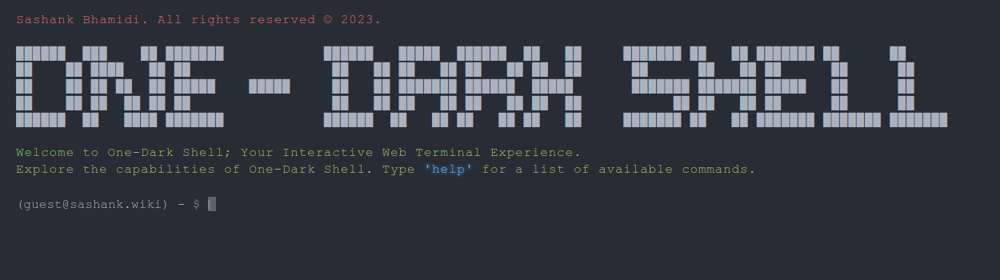
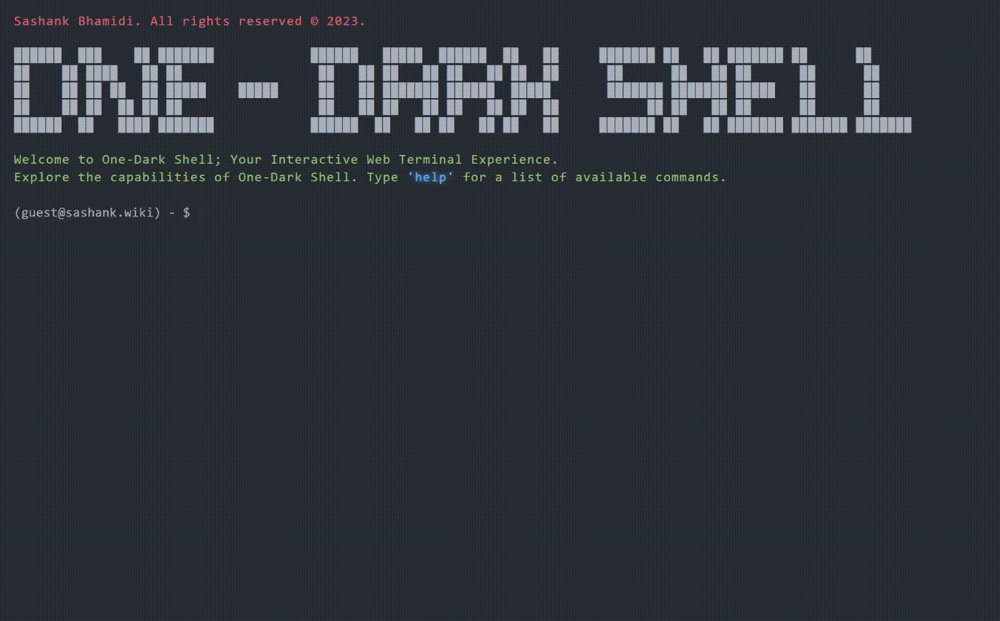

# One Dark Shell

## Overview

One-Dark Shell is a unique terminal-based portfolio that combines the aesthetics of the One Dark theme with an interactive command-line interface. This project serves as a platform to showcase my personal and professional journey, coding projects, skills, and contact information in a developer-friendly environment.

## Available Commands

- **`achievements`**: Highlight notable achievements, awards, or certifications.
- **`contact`**: Display contact information for easy communication.
- **`education`**: Provide details about educational background.
- **`experience`**: Share information about professional work experience.
- **`help`**: Display a help menu with available commands.
- **`projects`**: List coding projects with descriptions and links.
- **`resume`**: Display or link to a downloadable resume.
- **`skills`**: Showcase technical skills, programming languages, and tools.
- **`social`**: Show links to social media profiles.
- **`whoami`**: Display personal information and a brief introduction.

## Secret Commands

- `sudo`: A playful command acknowledging the attempt but with no specific action.
- `jokes`: Need a good laugh? Enter this command for some jokes!

## Screenshots

  
Click to view Screenshots and GIF

  <!--  -->
  

## Acknowledgments

- The [One Dark theme](https://github.com/atom/one-dark-syntax) for inspiration.

## License

This project is licensed under the [MIT License](LICENSE).

## Contact

- Email: [hello@sashank.wiki](mailto:hello@sashank.wiki)
- LinkedIn: [sashankbhamidi](https://www.linkedin.com/in/sashankbhamidi/)
- Twitter: [@sashanksayshi](https://twitter.com/sashanksayshi)

Feel free to reach out if you have any questions, suggestions, or just want to connect!
